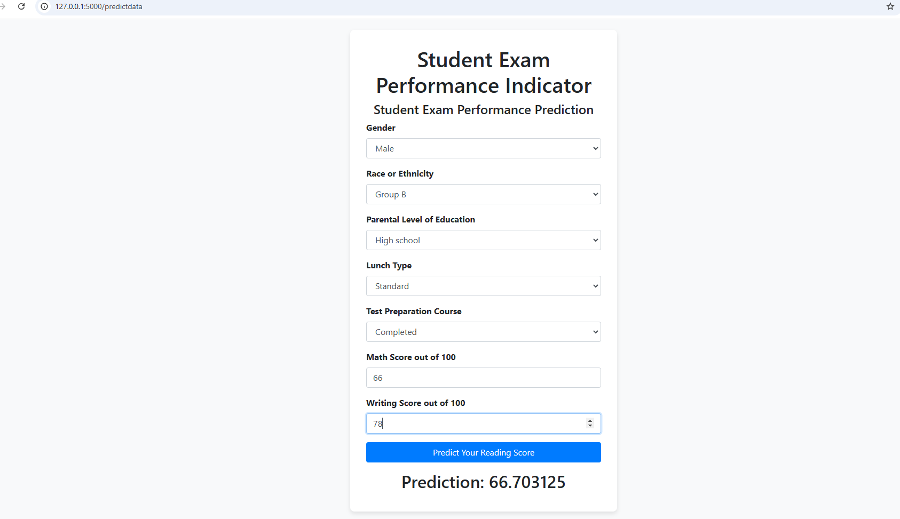

# Student Performance Indicator - Flask Deployment 📊

## Overview 🎯
This project explores factors influencing student performance in exams, including gender, ethnicity, parental education, lunch type, and test preparation. The analysis follows a structured EDA workflow to uncover patterns and insights from the dataset.

**Key Questions**:
- How do demographic factors affect test scores?
- What is the distribution of scores across subjects?
- Which groups perform exceptionally well or poorly?

## Dataset 📂
**Source**: [Students Performance in Exams (Kaggle)](https://www.kaggle.com/datasets/spscientist/students-performance-in-exams?datasetId=74977)  
**Size**: 1000 students, 8 features  
**Features**:
- Categorical: `gender`, `race/ethnicity`, `parental_level_of_education`, `lunch`, `test_preparation_course`
- Numerical: `math_score`, `reading_score`, `writing_score`

## Key Steps 🔍
1. **Data Checks**  
   - No missing values or duplicates
   - Data type validation and unique value analysis

2. **Feature Engineering**  
   - Added `total_score` (sum of all scores)  
   - Calculated `average` score

3. **Exploratory Analysis**  
   - Score distributions (histograms, KDE plots)  
   - Outlier detection (students with 0/100 scores)  
   - Impact analysis of categorical variables

4. **Key Insights**  
   - Math scores show the highest variability  
   - 17 students scored full marks in reading (highest among subjects)  
   - Students with "standard lunch" and "completed test prep" performed better  
   - Parental education level correlates with higher scores 

- The model recieved 91% accuracy in predicting the reading score of students based on other features. The model was then deployed in Flask environment. 

